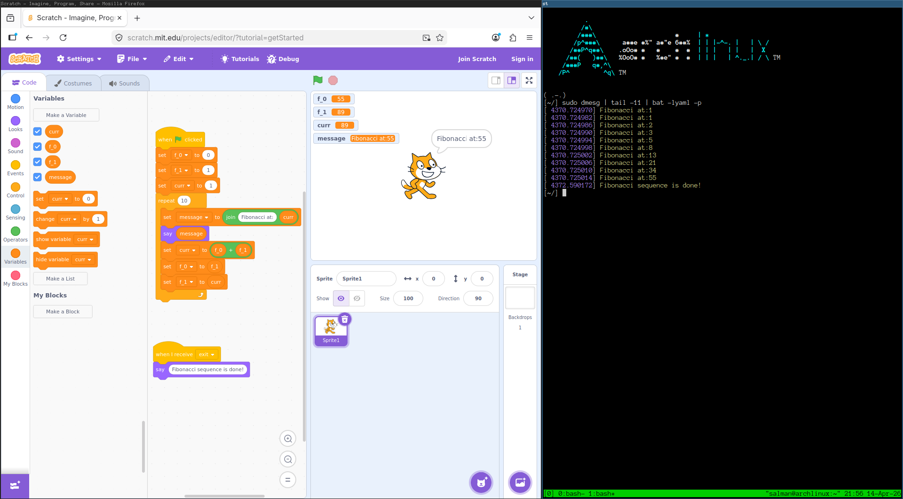

# scratch2c

Convert MIT Scratch 3 (`.sb3`) projects into compilable C code.

scratch2c reads a Scratch project, builds an intermediate representation, infers C types for every variable, and emits clean C source for one of two targets: a **standalone userspace program** or a **Linux kernel module**.

## What this is

A working alternative of the scratchnative program. If you've built something in Scratch and wondered how it will look like as C code, or you want to run your project as a real process on your laptop, or just learning about compilers, transpilers, and type systems and randomly stumbled upon this project, this is for you.

## What this is NOT

- A complete Scratch VM reimplementation
- A tool that supports graphics, sound, sprites, or anything visual
- Something that aims to run every Scratch project

## Quickstart

```bash
# Clone and sync
git clone https://github.com/scratch2c/scratch2c.git
cd scratch2c
uv sync

# Transpile + compile + run (userspace)
make compile-userspace SB3=my_project.sb3
./build/my_project

# Transpile + build kernel module (needs linux-headers)
make kbuild SB3=my_project.sb3
sudo insmod build/my_project.ko
dmesg | tail
```

The Makefile handles copying `scratch_runtime.h` into the build directory, picking the right compiler flags, and invoking kbuild for kernel targets. You can also transpile without compiling:

```bash
make userspace SB3=my_project.sb3   # just emit build/my_project.c
make kernel    SB3=my_project.sb3   # just emit build/my_project.c (kernel)
```

Or call the CLI directly:

```bash
uv run scratch2c my_project.sb3 -o output.c --backend userspace
uv run scratch2c my_project.sb3 -o output.c --backend kernel
```

## Supported blocks

| Category | Opcode | C output |
|----------|--------|----------|
| Events | `event_whenflagclicked` | `main()` / `module_init()` |
| Events | `event_whenbroadcastreceived` (init) | `module_init()` |
| Events | `event_whenbroadcastreceived` (exit) | `module_exit()` |
| Events | `event_whenbroadcastreceived` (other) | named function |
| Control | `control_repeat` | `for` loop |
| Control | `control_forever` | `while (1)` |
| Control | `control_repeat_until` | `while (!cond)` |
| Control | `control_wait_until` | spin-wait loop |
| Control | `control_if` | `if` |
| Control | `control_if_else` | `if / else` |
| Control | `control_stop` | `return` |
| Control | `control_wait` | comment (no-op) |
| Data | `data_setvariableto` | assignment |
| Data | `data_changevariableby` | `+=` |
| Data | `data_variable` | variable read |
| Looks | `looks_say` | `printf()` / `printk()` |
| Looks | `looks_sayforsecs` | `printf()` + comment |
| Operators | `operator_add/subtract/multiply/divide/mod` | arithmetic |
| Operators | `operator_lt/gt/equals` | comparison |
| Operators | `operator_and/or/not` | boolean logic |
| Operators | `operator_join` | `scratch_join()` |
| Operators | `operator_length` | `scratch_strlen()` |
| Operators | `operator_letter_of` | `scratch_letter_of()` |
| Operators | `operator_contains` | `scratch_contains()` |
| Procedures | `procedures_definition` | function definition |
| Procedures | `procedures_call` (with args) | function call |

## Known limitations

- **No lists.** Scratch lists would require dynamic arrays in C. Not implemented yet.
- **Type inference is heuristic.** If a variable holds both numbers and strings in the same program, the transpiler picks STRING as a safe fallback, but some edge cases may produce wrong types.
- **No concurrency.** Scratch runs multiple scripts in parallel via green threads. We emit them sequentially.
- **Procedure arguments are always `long`.** Mixed-type procedure arguments need a tagged union, which we don't have yet.
- **No clone/sprite interaction.** Multi-sprite programs are flattened.

## Development

```bash
uv sync                                            # install everything
make test                                          # run test suite
make compile-userspace SB3=projects/fibonacci.sb3  # transpile + gcc
make kbuild SB3=projects/fibonacci.sb3             # transpile + kbuild
make example-fib                                   # dump both backends to stdout
make lint                                          # mypy type-check
make clean                                         # nuke build/
```

## License

MIT. See [LICENSE](LICENSE).
